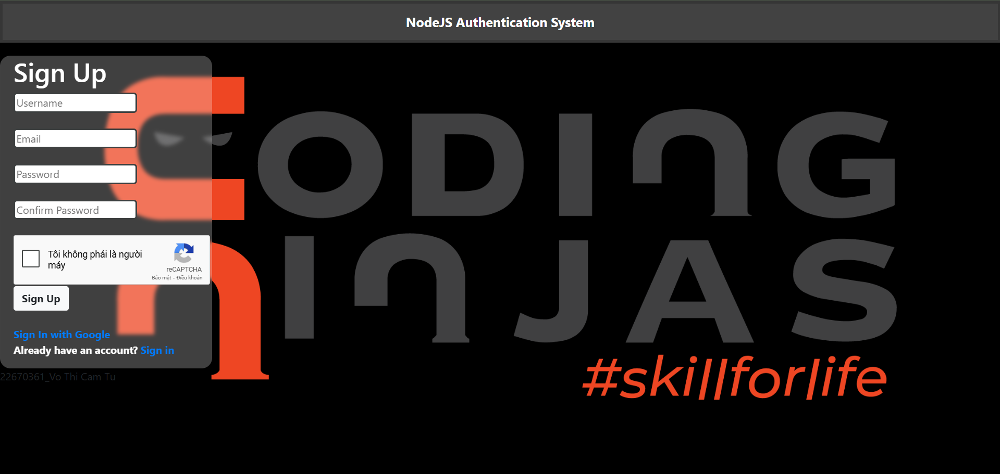
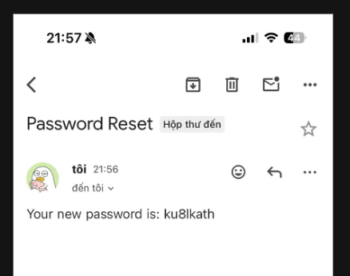

# Report: Hệ thống Authentication
## Cây thư mục
  

## Thay đổi code

### Thêm file .env để set port và chạy bài
  

##### Thay đổi code trong router thư mục gốc của file app.js để đưa đường dẫn đến phần login, đẩy code views/signin.ejs lên web
  

##### Giao diện sau khi chỉnh router
  

### Chỉnh capcha
##### Đăng ký mã capcha trên https://www.google.com/recaptcha
  

##### Sau khi đăng ký xong ta sẽ có 2 mã public key và private key 
  
- Public key: dùng để ghi lên các giao diện  "<divclass="g-recaptcha" data-sitekey="--public key--">
"

- Private key: ghi trong file .env
- 

-
Hình ảnh chỉ mang tính chất minh họa về key

##### Kết quả
  

### Đăng nhập bằng google

##### Đăng ký tài khoản https://console.cloud.google.com/
 

# Test các chức năng

### Tạo một mật khẩu để gửi mã về email

- Các bước
+ B1: Đăng nhập vào Tài khoản Google

+ B2: Vào Security → 2-Step Verification → bật nếu chưa bật.

+ B3: Sau khi bật 2FA, vào Security → App Passwords.

+B4: Chọn:

Select app: Mail

Select device: Other (tên gì cũng được, ví dụ NodeMailer)

+ B5: Nhấn Generate → Google sẽ cung cấp một mật khẩu 16 ký tự.
Đây là mật khẩu dùng để gửi email từ ứng dụng Node.js.

### Đăng ký
 

### Đăng nhập
 
#### Giao diện sau khi đăng nhập
 

### Đổi mật khẩu
- Đổi mật khẩu

- Đăng nhập với mật khẩu mới

### Quên mật khẩu
- Nhập email 

- Mật khẩu sẽ được gửi về email
- 

### Đăng xuất
 

## 🚀 Kết luận

- Hệ thống đã triển khai được:
  - Đăng ký, đăng nhập cơ bản.  
  - Captcha chống bot.  
  - Reset/đổi mật khẩu.  
  - Đăng nhập Google OAuth2.  
  - Quản lý profile cá nhân.  

Các ảnh trong thư mục **public/results/** minh chứng cho từng bước triển khai hệ thống.
