# Report: Hệ thống Authentication
## Cây thư mục
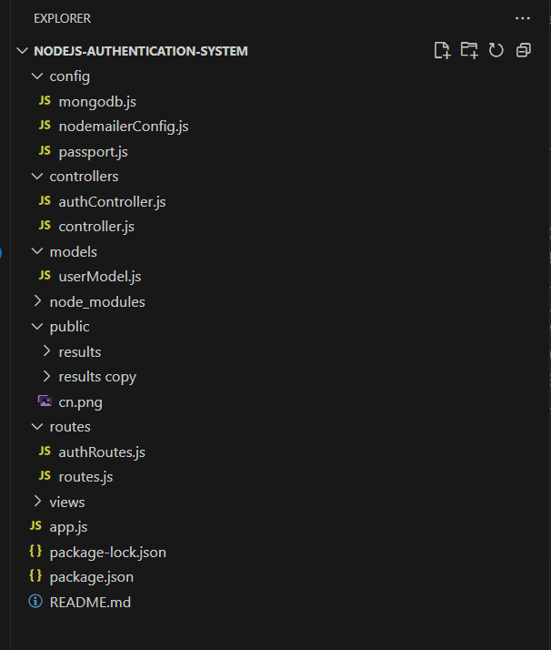  

## Thay đổi code

### Thêm file .env để set port và chạy bài
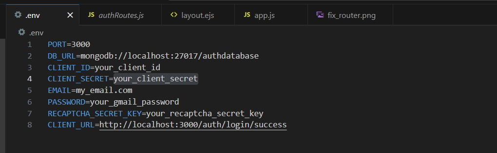  

##### Thay đổi code trong router thư mục gốc của file app.js để đưa đường dẫn đến phần login, đẩy code views/signin.ejs lên web
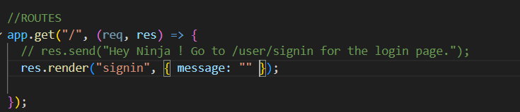  

##### Giao diện sau khi chỉnh router
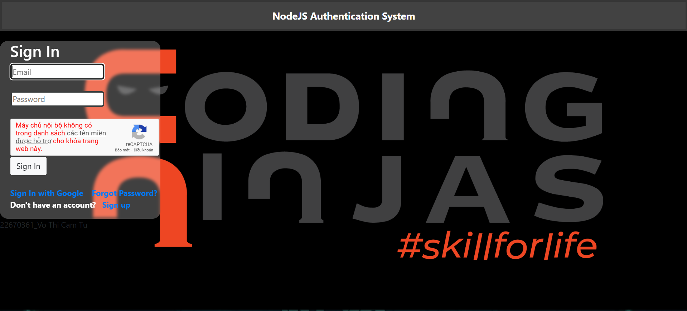  

### Chỉnh capcha
##### Đăng ký mã capcha trên https://www.google.com/recaptcha
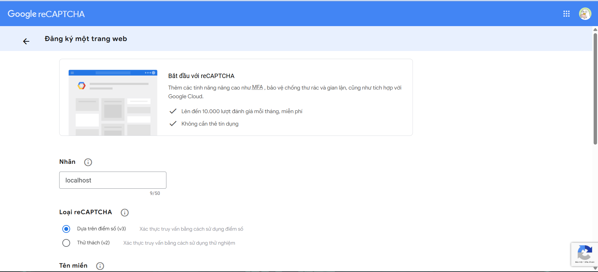  

##### Sau khi đăng ký xong ta sẽ có 2 mã public key và private key 
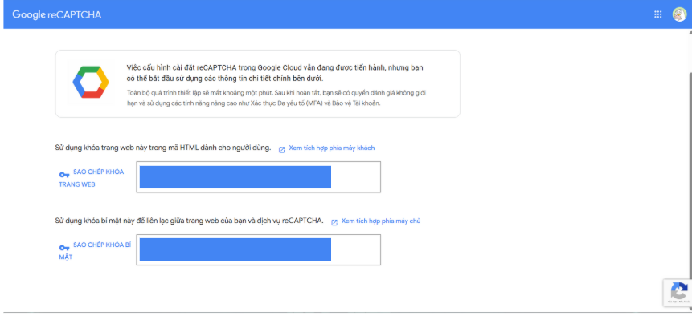  
- Public key: dùng để ghi lên các giao diện  "<divclass="g-recaptcha" data-sitekey="--public key--">
"
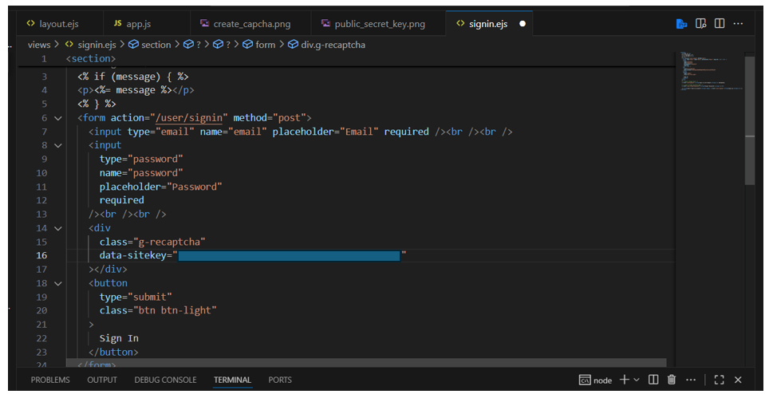
- Private key: ghi trong file .env
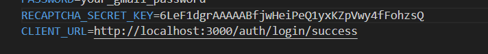
Hình ảnh chỉ mang tính chất minh họa về key

##### Kết quả
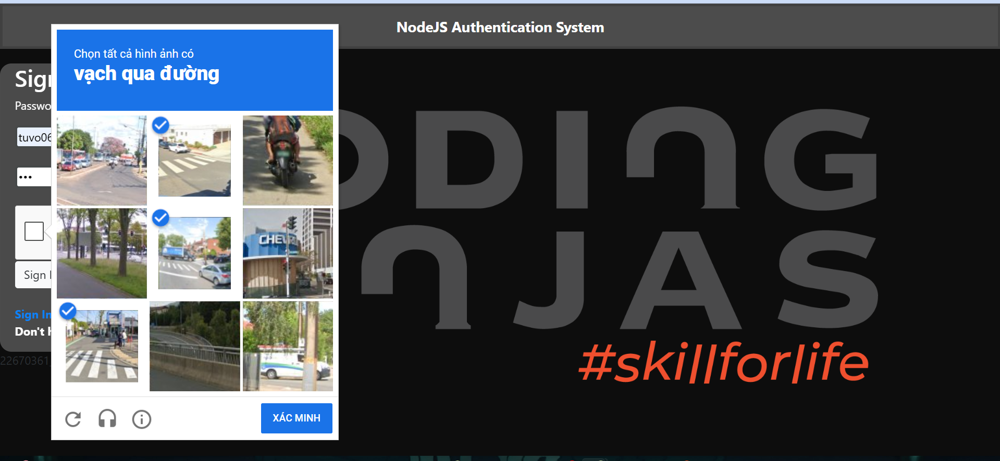  

##### Thêm file .env để set port và chạy bài
  

- 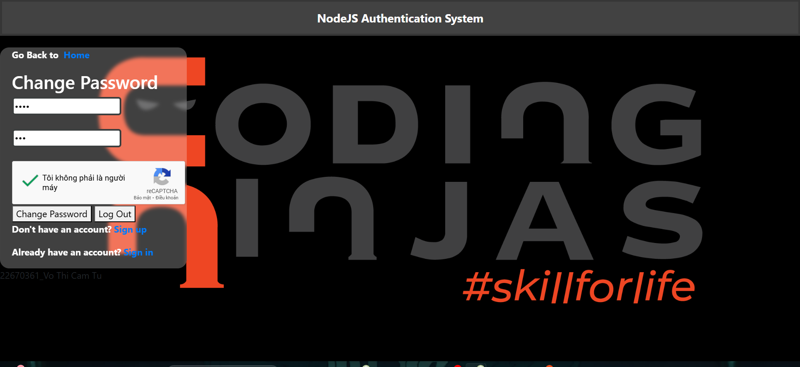  
  Giao diện đổi mật khẩu.

-   
  Tạo Captcha ngẫu nhiên.

- 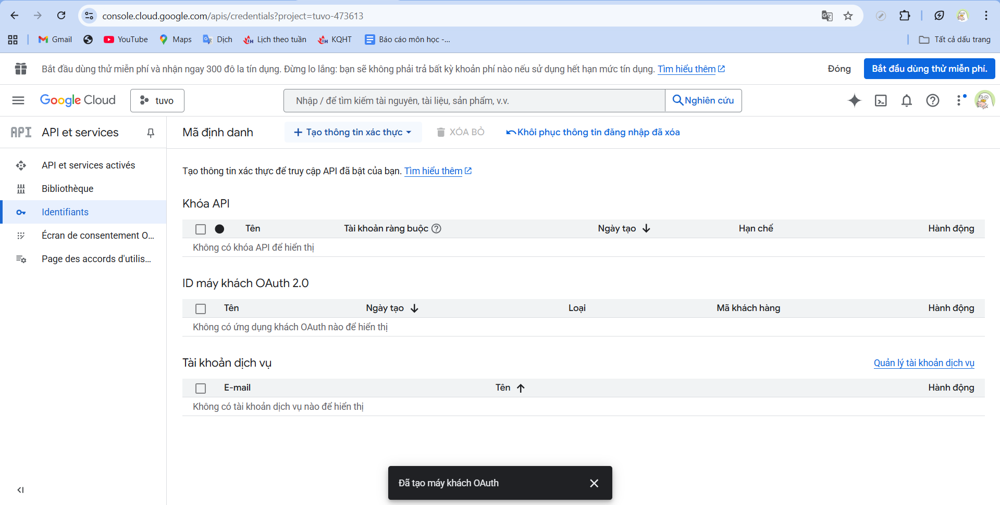  
  Cấu hình OAuth2 cho đăng nhập Google.

-   
  Sửa router trong hệ thống.

- 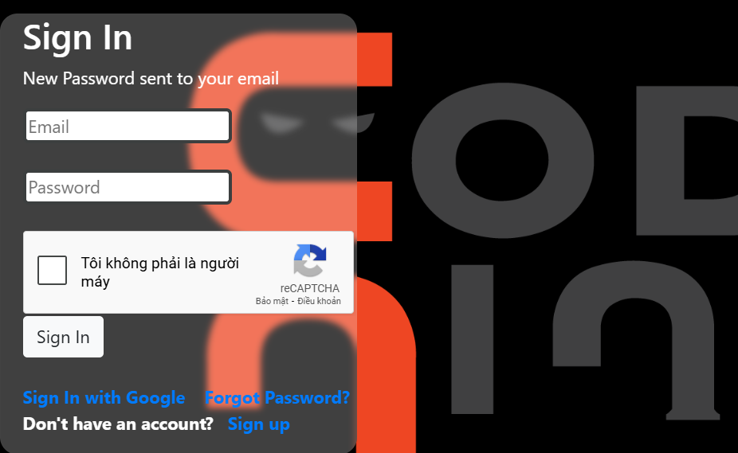  
  Chức năng quên mật khẩu.

-   
  Giao diện trang chủ (phiên bản 1).

- 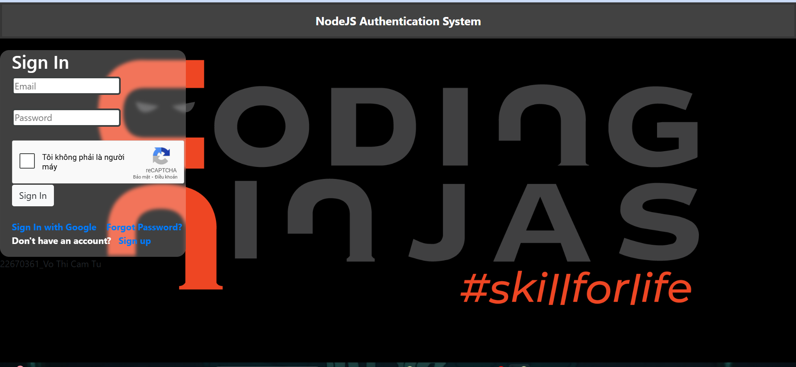  
  Giao diện trang chủ (phiên bản 2).

- 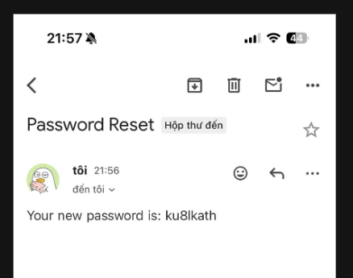  
  Hình minh họa chung.

- 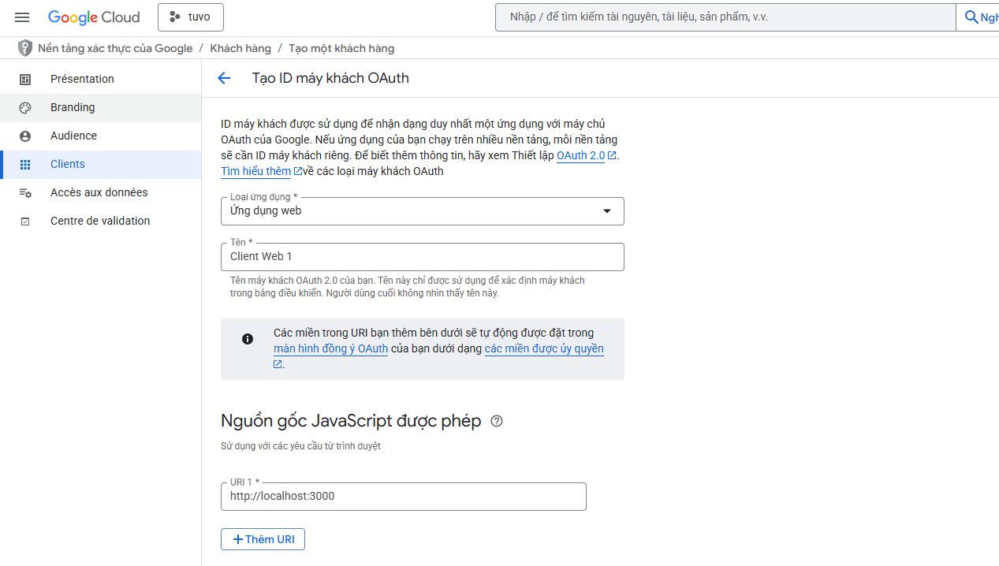  
  Thông tin user sau khi login bằng OAuth.

- 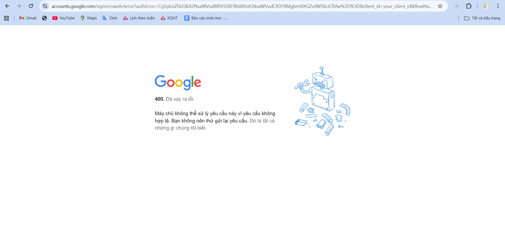  
  Lỗi khi đăng nhập Google thất bại.

- 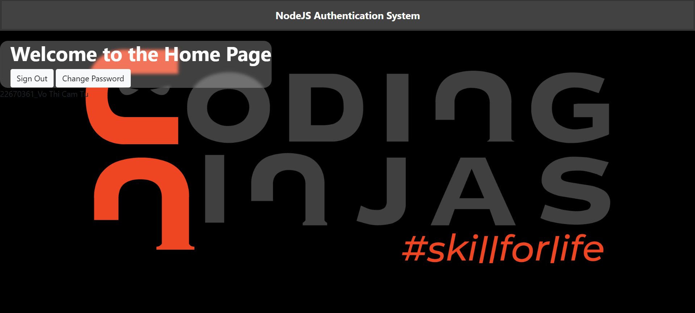  
  Đăng nhập lại bằng mật khẩu mới.

- 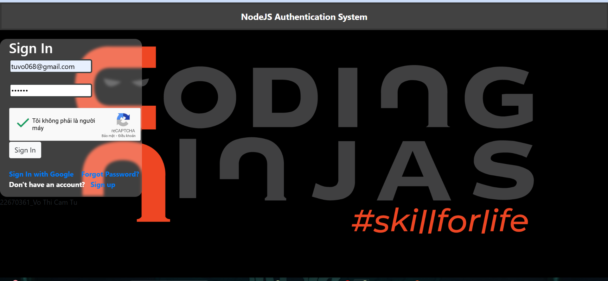  
  Form đăng nhập cơ bản.

-   
  Khóa riêng tư (JWT hoặc OAuth).

- 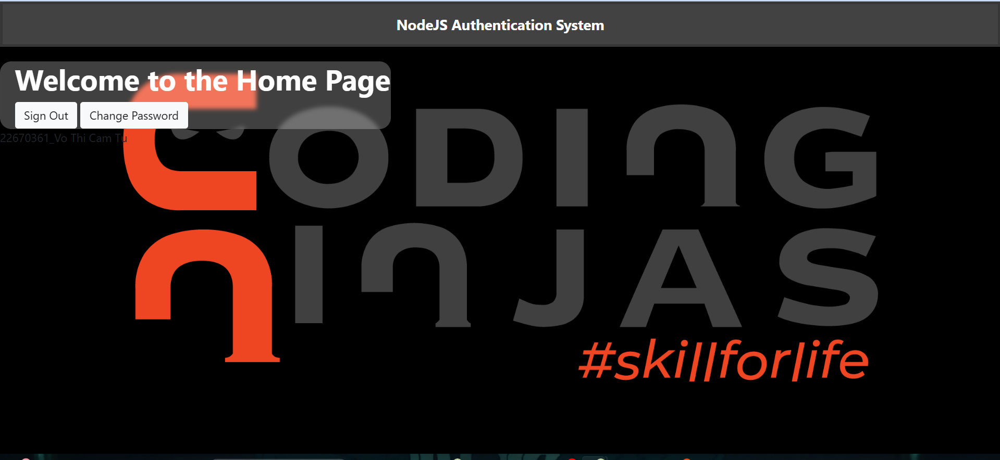  
  Trang thông tin cá nhân.

-   
  Khóa công khai.

-   
  Bộ key bảo mật.

-   
  Đăng ký với Captcha bảo mật.

- 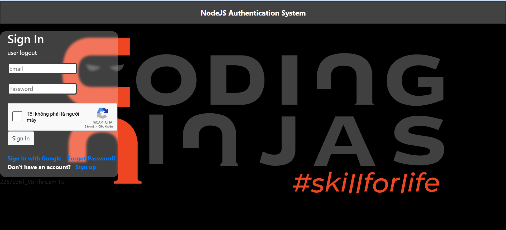  
  Chức năng đăng xuất.

-   
  File `.env` chứa cấu hình.

-   
  Hình minh họa khác (có thể là chứng nhận / cấu hình).

## 🚀 Kết luận

- Hệ thống đã triển khai được:
  - Đăng ký, đăng nhập cơ bản.  
  - Captcha chống bot.  
  - Reset/đổi mật khẩu.  
  - Đăng nhập Google OAuth2.  
  - Quản lý profile cá nhân.  

Các ảnh trong thư mục **public/results/** minh chứng cho từng bước triển khai hệ thống.
